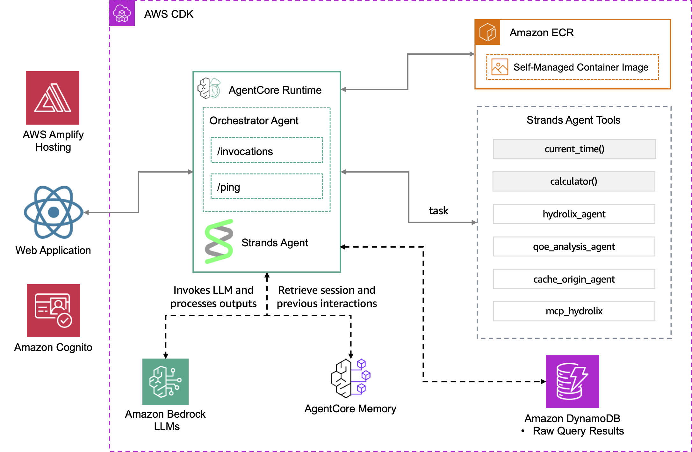
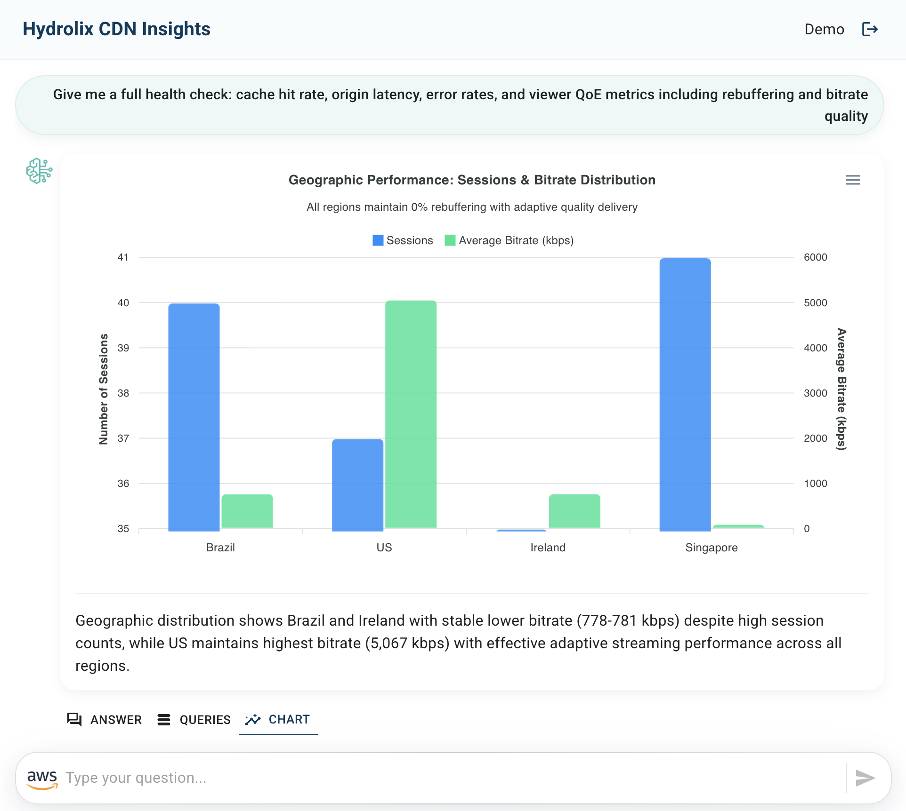

# Deploying Hydrolix CDN Insights with Amazon Bedrock AgentCore

> [!IMPORTANT]
> **🚀 Ready-to-Deploy Agent Web Application**: Use this reference solution to build other agent-powered web applications across different industries. Extend the agent capabilities by adding custom tools for specific industry workflows and adapt it to various business domains.

This solution provides a Generative AI application called **Hydrolix CDN Insights** that allows users to interact with Hydrolix CDN and streaming video data through a natural language interface. The solution leverages **[Amazon Bedrock AgentCore](https://aws.amazon.com/bedrock/agentcore/)**, a managed service that enables you to deploy, run, and scale custom agent applications, along with the **[Strands Agents SDK](https://strandsagents.com/)** to build an agent that connects to Hydrolix time-series data, providing real-time analytics capabilities through a web application interface.

🤖 Hydrolix CDN Insights offers an approach to CDN and streaming video analytics that enables enterprises to interact with their time-series data through natural language conversations rather than complex SQL queries. This assistant provides an intuitive question-answering interface for data analysis conversations and can be improved by offering data visualizations to enhance the user experience.

✨ This solution enables users to:

- Ask questions about CDN performance and streaming video metrics in natural language
- Receive AI-generated responses based on SQL queries to Hydrolix time-series database
- View query results in tabular format
- Explore data through automatically generated visualizations
- Get insights and analysis from the AI assistant specialized in:
  - Cache performance and hit rates
  - Quality of Experience (QoE) metrics
  - Origin server performance
  - Edge location analytics
  - Rebuffering and playback issues

🚀 This reference solution can help you explore use cases like:

- Monitor real-time CDN performance and cache efficiency
- Analyze streaming video quality and viewer experience
- Identify and troubleshoot performance bottlenecks
- Optimize content delivery across edge locations
- Track origin server health and latency

## Solution Overview

The following architecture diagram illustrates a reference solution for Hydrolix CDN Insights, a generative AI assistant built using Strands Agents SDK and powered by Amazon Bedrock. This assistant enables users to access time-series CDN and streaming video data stored in Hydrolix through a question-answering interface.

> [!IMPORTANT]
> This sample application is meant for demo purposes and is not production ready. Please make sure to validate the code with your organizations security best practices.

### CDK Infrastructure Deployment

The AWS CDK stack deploys and configures the following managed services:

**Amazon Bedrock AgentCore Resources:**
- **[AgentCore Runtime](https://docs.aws.amazon.com/bedrock-agentcore/latest/devguide/agents-tools-runtime.html)**: Provides the managed execution environment with invocation endpoints (`/invocations`) and health monitoring (`/ping`) for your agent instances
- **[AgentCore Memory](https://docs.aws.amazon.com/bedrock-agentcore/latest/devguide/memory.html)**: A fully managed service that gives AI agents the ability to remember, learn, and evolve through interactions by capturing events, transforming them into memories, and retrieving relevant context when needed

The AgentCore infrastructure handles all storage complexity and provides efficient retrieval without requiring developers to manage underlying infrastructure, ensuring continuity and traceability across agent interactions.

**Data and Configuration Infrastructure:**
- **Amazon DynamoDB**: Stores raw query results for data analysis audit trails
- **AWS Secrets Manager**: Secure storage for Hydrolix connection credentials (host, port, username, password)
- **[Hydrolix MCP Server](https://github.com/hydrolix/mcp-hydrolix)**: Model Context Protocol package for querying Hydrolix time-series data

### Amplify Deployment for the Front-End Application

- **React Web Application**: Delivers the user interface for the assistant
    - Uses Amazon Cognito for user authentication and permissions management
    - The application invokes the Amazon Bedrock AgentCore for interacting with the assistant
    - For chart generation, the application directly invokes the Claude Haiku 4.5 model

### Strands Agent Features

| Feature | Description |
|----------|----------|
| Model Provider | Amazon Bedrock (Claude Haiku 4.5) — Powers the orchestrator and all specialized subagents. |
| Specialized Subagents | The orchestrator routes user questions to domain-expert subagents, each with its own system prompt, tools, and specialized knowledge:  🔍 `hydrolix_agent` - **General Data Analyst** — Default subagent for time-series data exploration, traffic overviews, and ad-hoc queries across all dimensions. 🗄️ `cache_origin_agent` - **CDN Infrastructure Expert** — Specialized in cache hit/miss analysis, origin server latency, error rates, bandwidth cost, and edge location (POP) performance. Works with CDN access log data (near-100% fill rate). 📺 `qoe_analysis_agent` - **Viewer Experience Expert** — Specialized in Quality of Experience (QoE) using CMCD player telemetry: buffer starvation, bitrate adaptation, throughput, startup performance, and geographic QoE breakdown. Validates data quality before analysis.  💡 *New specialized subagents can be added to extend the system — for example, **an anti-piracy agent for detecting unauthorized content distribution, or a bot-detector agent for identifying suspicious traffic patterns**.* |
| MCP Integration | **[Hydrolix MCP Server](https://github.com/hydrolix/mcp-hydrolix)** — Model Context Protocol package used by each specialized subagent to query the Hydrolix time-series database, including schema inspection and SQL query execution. Each subagent initializes its own MCP client to run queries independently. |
| Native Tools | Built-in Strands tools available to the orchestrator and each specialized subagent: `current_time` - Provides current date and time information based on user's timezone. `calculator` - Performs mathematical calculations: percentages, ratios, statistical metrics. |

> [!NOTE]
> The React Web Application uses Amazon Cognito for user authentication and permissions management, providing secure access to Amazon Bedrock AgentCore and Amazon DynamoDB services through authenticated user roles.

> [!IMPORTANT] 
> Enhance AI safety and compliance by implementing **[Amazon Bedrock Guardrails](https://aws.amazon.com/bedrock/guardrails/)** for your AI applications with the seamless integration offered by **[Strands Agents SDK](https://strandsagents.com/latest/user-guide/safety-security/guardrails/)**.

The **user interaction workflow** operates as follows:

- The web application sends user questions about CDN performance or streaming metrics to the AgentCore Invoke
- The Strands Agent (powered by Claude Haiku 4.5) processes natural language and routes to specialized sub-agents (hydrolix_agent, qoe_analysis_agent, or cache_origin_agent)
- The specialized agents use MCP Hydrolix tools to execute SQL queries against the Hydrolix time-series database and formulate answers
- AgentCore Memory captures session interactions and retrieves previous conversations for context
- After the agent's response is received by the web application, the raw data query results are retrieved from the DynamoDB table to display both the answer and the corresponding records
- For chart generation, the application invokes a model (powered by Claude Haiku 4.5) to analyze the agent's answer and raw data query results to generate the necessary data to render an appropriate chart visualization

## Deployment Instructions

The deployment consists of two main steps:

1. **[Amazon Bedrock AgentCore Deployment with CDK](./cdk-hydrolix-data-assistant-agentcore-strands/)**
2. **[Front-End Implementation with Amplify](./amplify-hydrolix-data-assistant-agentcore-strands/)**

> [!NOTE]
> *It is recommended to use the Oregon (us-west-2) or N. Virginia (us-east-1) regions to deploy the application.*

> [!IMPORTANT] 
> Remember to clean up resources after testing to avoid unnecessary costs by following the clean-up steps provided.

## Application Preview

## Thank You

## License

This project is licensed under the Apache-2.0 License.